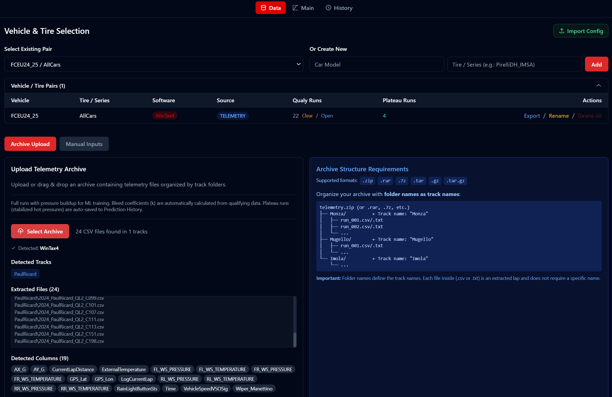
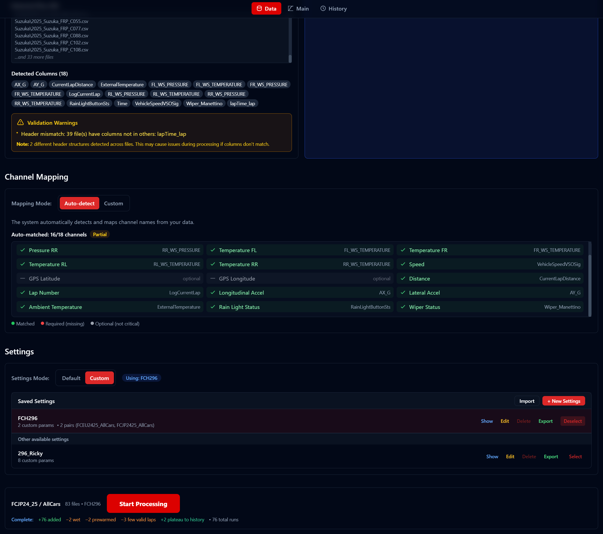
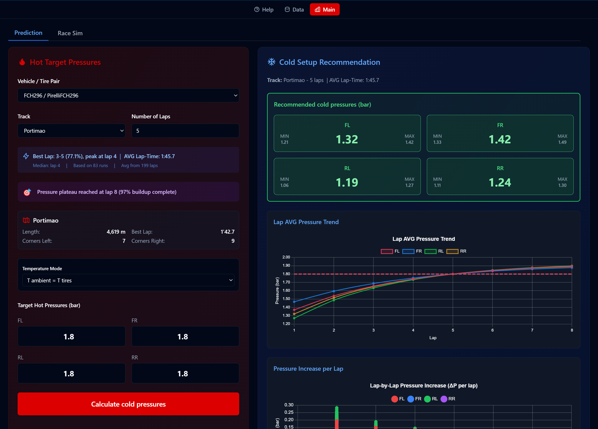
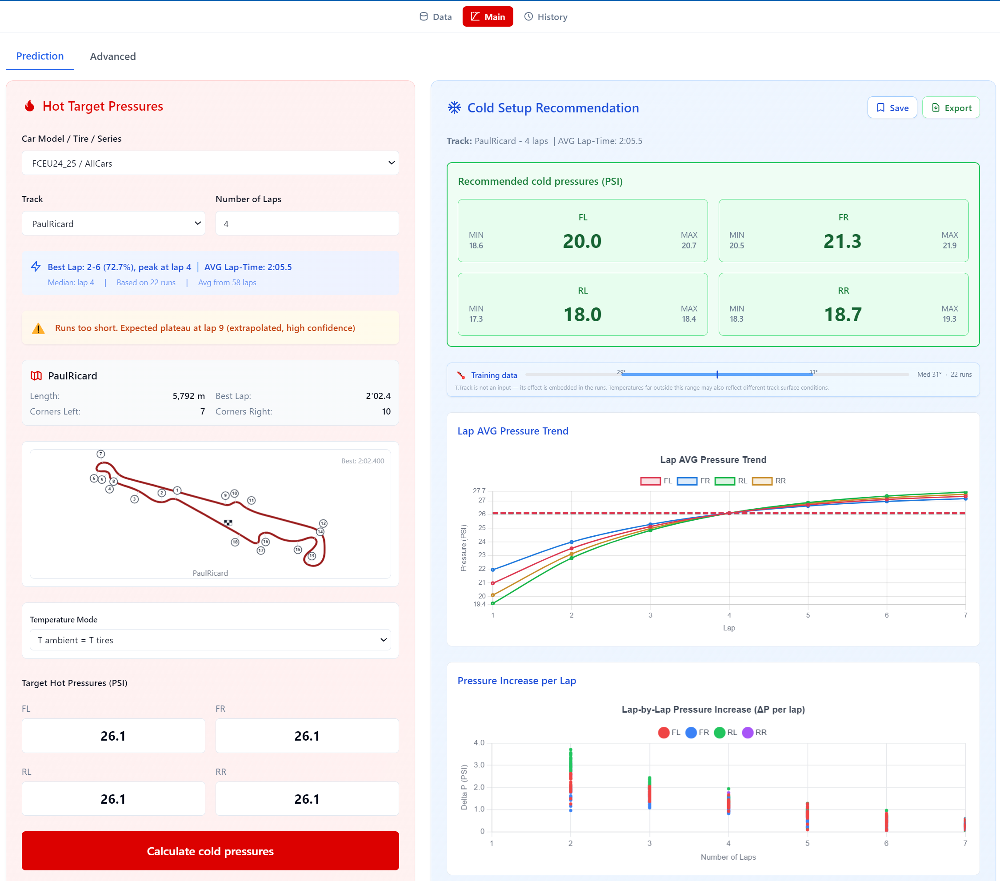
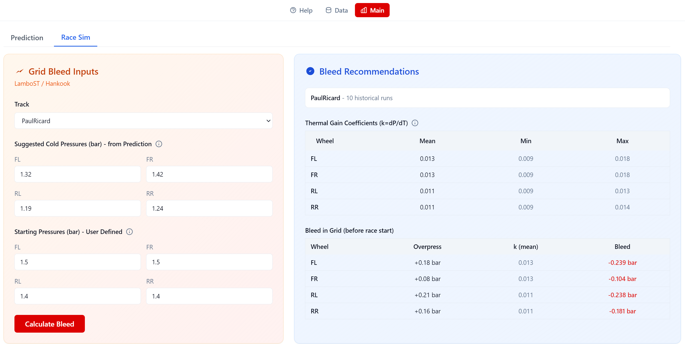
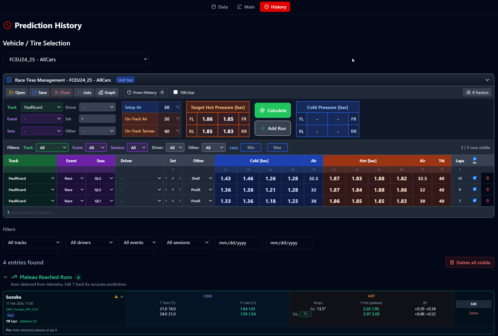

# Tire Pressure Predictor

A professional tool for racing passionates that predicts optimal cold tire pressures to achieve target hot pressures during a stint.

## Overview

Tire Pressure Predictor uses a ML model trained on real telemetry data to predict the cold tire pressures needed to reach your target hot pressures after a specified number of laps in a specific track.

Instead of relying on trial-and-error or simplified linear formulas, this tool provides data-driven predictions based on previous data.

## Features

- **ML-based predictions** - Trained on real telemetry data for accurate results
- **Multi-software** - Import data from all telemetry softwares: Motec/WinDarab/WinTAX etc
- **Track-specific analysis** - Accounts for track characteristics
- **Pressure trend visualization** - Charts showing pressure evolution over laps
- **Auto track detection** - Uses GPS to automatically select the nearest circuit
- **Race Simulation mode** - Suggests the bleed to adopt after formation laps based on hystoric runs
- **NO TPMS mode** - For vehicles without Tire Pressure Monitoring System, get predictions with input-output simplified model
- **Custom track support** - Add tracks not in the database with scaling coefficients based on tracks similarity
- **Thermal correction tables** - Fine-tune predictions based on ambient conditions

## Screenshots

### Vehicle & Tire Selection
Manage vehicle/tire pairs, upload telemetry archives, and track processing status.

### Data Processing & Channel Mapping
Import telemetry data with automatic software detection, channel mapping, and named settings.

### Main Prediction Screen (Dark Mode)
Set your target hot pressures, select the track and number of laps, and get recommended cold pressures with pressure trend charts.

### Main Prediction Screen (Light Mode, PSI)
Switch to PSI display with the global pressure unit toggle. All values convert automatically.

### Bleed Correction
Bleed correction with thermal gain coefficients — choose between Constant Bleed, Custom Start P, or Custom k modes.

### Prediction History & Race Tires Management
Track saved predictions, manage race tire setups, and view auto-detected plateau runs. Designed for use with tyre heaters and stabilized pressure runs.

## System Requirements

- **OS:** Windows 10/11 (64-bit)
- **RAM:** 4 GB minimum
- **Disk:** 200 MB free space

## Installation

1. Download the latest installer from [Releases](../../releases)
2. Run `Tire Pressure Predictor Setup X.X.X.exe`
3. Follow the installation wizard
4. Launch the app from the Start Menu or Desktop shortcut

## License

This software requires a license to use. To obtain a license:

1. Visit [tirepressurepredictor.com](https://tirepressurepredictor.com) *(or contact info below)*
2. Contact the developer to request a license key
3. Enter the license key when prompted in the app

## Contact

For license requests, support, or feedback:

- **Email:** lvillaengineering@gmail.com

## Changelog

### v2.7.2 (Latest)
- **Per-run processing details**: After processing, a "▼ Run details" toggle shows the result of each run — added/discarded status, aborted lap number, plateau start lap, and prewarmed ΔT
- **Smart re-processing of excluded files**: Discarded runs (wet, prewarmed, insufficient laps, etc.) are skipped on repeat processing unless relevant settings change — less noise in the summary
- **Manual update control**: Update notification banner lets you choose when to download — no automatic background downloads

### v2.7.1
- **Clear Data bug**: Clicking "Clear" on Qualy/Race Runs no longer resets Channel Mapping, Settings, and Run Processing UI state

### v2.7.0
- **Linked Folder**: Select a folder of telemetry CSV files directly — no need to ZIP them first. The folder is linked to the vehicle/tire pair and remembered across sessions
- **Auto re-scan on processing**: Linked folders are automatically re-scanned when clicking Run Processing, picking up new files added since last scan
- **New file detection (60s polling)**: Periodic check detects new CSV/TXT files in the linked folder and shows an amber banner notification in the Data tab
- **Auto-scan on pair selection**: When a linked folder exists, it is automatically scanned when the vehicle/tire pair is selected
- **Data Structure Info**: Updated info card documenting both Linked Folder and Archive workflows with structure examples

### v2.6.5
- **Pressure Unit Toggle (bar/PSI)**: Global toggle switch in the header to display all pressures in bar (default) or PSI. Conversion is display-only — all storage, calculations, and exports remain in bar
- **Full App Coverage**: Unit toggle applies across Main tab (target/recommended pressures), History cards, Race Tires Management, Runsheet Editor, Data tab settings, and charts
- **Smart Input Conversion**: Pressure inputs automatically adapt step size, decimal precision, and min/max bounds when switching units
- **Race Tires Management — Event Lists**: Event type is now a managed list (like Tracks, Sessions, Drivers) instead of hardcoded Race/Test. Add custom event types via Lists manager and filter by them
- **Race Tires Management — Add Run Fix**: "Add Run" now correctly copies calculated cold/hot pressures to the new row instead of adding empty values
- **Footer Website Links**: Links to tirepressurepredictor.com and motorsportsoftware.com centered in footer

### v2.6.4
- **Help Tab — Comprehensive Rewrite**: Complete rewrite with collapsible Quick Start Guide (Data, Main, History), Features & Details (Processing, Prediction, History, Configuration, Files/Shortcuts), and updated Telemetry Software Export Templates
- **Help — Icon Button**: Help moved from tab bar to a toggle (?) button next to dark mode. Click toggles on/off, returning to previous tab
- **Track Layout — Corner Numbering**: Numbered corner markers positioned outside the track line with leader lines, like technical drawings
- **Track Layout — Redesign**: Dark red track line (theme-aware), checkered start/finish flag
- **Training Data — Track Temperature Note**: Explains why T.Track is not a separate input and how ambient temperature range relates to track surface conditions
- **Help — Short vs Long Run Guidance**: Data tab for short runs (ML model training) vs Race Tires Management for long run stabilized pressure analysis

### v2.6.3
- **Manual Inputs (renamed)**: "Excel Upload" tab renamed to "Manual Inputs" across the entire UI
- **Runsheet Editor — Simplified T_cold**: Single "T amb" column replaces 4 per-wheel cold temperature columns
- **Runsheet Editor — Always-editable cells**: Native dropdowns always visible, numeric cells always editable

### v2.6.2
- **Training Data Conditions Indicator**: Visual range bar in Main tab showing ambient temperature range of training data (green/amber/red status)
- **Auto-Calculate Predictions**: Cold pressures update automatically when changing target hot pressures or laps (500ms debounce)
- **Runsheet Editor — List Manager**: Manage Track, Event, Session, Driver lists per pair
- **Runsheet Editor — T_track Column**: New optional track surface temperature column
- **Number Input Fix**: Fixed keyboard entry issues with decimal separators on Windows/Electron

### v2.6.1
- **WinTax4 CSV separator fallback**: Auto-detects comma-separated CSV when semicolon fails (English/Australian regional settings)

### v2.6.0
- **Plateau Valid Flag**: New `plateau_valid` column with selective propagation — aborted laps don't invalidate subsequent plateau data, recovering valid data from long runs
- **Auto-Save Plateau Runs**: Runs reaching pressure plateau (97% buildup) automatically saved to Prediction History as `plateau_auto` entries
- **Plateau Reached Runs Section**: New section in History tab for auto-detected plateau entries with emerald color scheme
- **.tpp File Association**: Double-click `.tpp` config files to open them directly in the app
- **Drag & Drop ZIP**: Drop archive files directly onto the Data tab upload area
- **Collapsible History Sections**: Saved Predictions and Plateau Reached Runs sections can be collapsed/expanded

### v2.5.4
- **Zoom Support**: Ctrl+scroll, Ctrl+Plus/Minus, and Ctrl+0 (reset) for zooming across the app
- **Generic "Other" Filter**: Renamed Compound column to "Other" for custom tagging (new/used, soft/medium/hard, etc.)
- **Frontend Log Rotation**: Fixed unbounded log growth (now 5MB × 2 backups)
- **Chromium Cache Limit**: Disk cache limited to 50MB (was 300MB+)

### v2.5.3
- **Windows Defender False Positive**: Installer adds Defender exclusions before extracting files, preventing sidecar.exe quarantine
- **Per-Machine Install**: Admin elevation for Defender exclusion commands

### v2.5.2
- **Min Valid Laps Setting**: Configurable minimum valid laps (default: 3) for quality data filtering
- **OptimumG Pressure Calculator**: Replaced incorrect Custom K formula with verified OptimumG ideal gas law algorithm
- **K Factors Loading**: Fixed crash when loading old saved data missing newer fields

### v2.5.1
- **Race Tires Management - Enhanced Ratio Mode**: Single reference run selection, auto-read pressures/temperatures, temperature corrections with configurable coefficients
- **Runsheet Editor Enhancements**: Auto-save, undo/redo, copy/paste, tab navigation, optional columns (Event, Session, Driver)
- **Excel Plateau Fix**: Corrected plateau lap estimation formula
- **Concatenated Runs Fix**: Fixed false detection with Ferrari logger lap counter reset

### v2.5.0
- **Runsheet Editor**: Interactive Excel pressure data editor with inline editing, validation, row operations, import modes, and Excel export
- **Compound Field**: New dropdown in Race Tires Management with custom list management
- **RAR5 Support**: WinRAR UnRAR.exe for better RAR5 compatibility
- **New Archive Formats**: `.rar4`, `.rar5`, `.zipx`, `.cab` support

### v2.4.4
- **Data Tab Feedback**: Warning when data loaded but no vehicle/tire pair selected
- **Electron Input Focus**: Fixed inputs not editable after file import

### v2.4.3
- **Rename Vehicle/Tire Pair**: Rename pairs without losing data (renames all associated files)
- **License Machine Binding**: One license per computer with deactivation for transfer
- **Portable Mode**: Run from USB drive with `portable.txt` flag

### v2.4.2
- **Multi-file TPC Import**: Select and import multiple `.tpc` files at once
- **Target Temperature Inputs**: Air (cold), Air (track), and Track temperature fields in Requirements

### v2.4.1
- **Export/Import Configuration**: Export vehicle/tire pair configs as `.tpp` files for migration/sharing
- **Search Bar in Data Tab**: Filter vehicle/tire pairs by car model or tire compound
- **Auto RunRegistry Generation**: Export auto-generates run registry from processed CSV

### v2.4.0
- **Race Tires Management - Advanced Graph**: ΔP vs ΔT and ΔP vs Laps charts with wheel toggles, mean/trend lines, driver/laps filters
- **Race Tires Management - Auto K Factors**: Per-wheel K factor calculation via linear regression with R² quality indicators
- **Race Tires Management - UX**: Air column, Track dropdown, Tire Set numeric input, Lists persistence, collapsible panel

### v2.3.1
- **Tire Change Data Shift**: Mid-session tire changes detected and handled — old tire data discarded, laps renumbered from new tires

### v2.3.0
- **Bleed Calculation Physics Model**: Real gas thermal expansion model replacing linear formula
- **Three Calculation Modes**: Constant Bleed, Custom Start P, Custom k
- **ΔT Statistics**: Per-wheel Min/Avg/Max temperature increase display

### v2.2.1
- **Bleed Calculation in Prediction Tab**: Integrated bleed correction with configurable N laps and overpressure
- **Tire Change Detection**: Distinguishes pressure bleeds from tire changes via temperature monitoring
- **New Settings**: Temperature drop threshold, valid samples threshold
- **Concatenated Runs Feedback**: Processing summary shows concatenated file count
- **Simplified Workflow**: Removed Race Sim tab — bleed calculation integrated into Prediction tab

### v2.2.0
- **Prediction History Tab**: Track and manage saved predictions over time with Excel-like grid layout
- **Save Predictions**: Store prediction setups with driver, event type (Race/Test), session name, tire condition
- **Export for Tyre Manager**: Generate clean text files with prediction data for easy communication
- **Verification Workflow**: Add actual hot pressures after sessions to compare with predictions
- **History Filtering**: Filter by track, driver, event type, session, and date range
- **Bulk Delete**: Delete all visible (filtered) predictions at once
- **History Preservation**: Prediction history preserved when deleting vehicle/tire pairs

### v2.1.6
- **Single Instance Lock**: Prevents multiple app instances from running simultaneously
- **Windows Defender Prompt**: Installer prompts for Windows Defender exclusions

### v2.1.5
- **Concatenated Runs Detection**: Auto-detects and rejects files with multiple runs concatenated
- **Multi-Format Archive Support**: Upload .zip, .rar, .7z, .tar, .gz archives
- **Track Layout Channel Mapping**: GPS track layout generator supports custom channel mapping

### v2.1.4
- **Plateau Calculation Robustness**: No longer requires all 4 wheels to have data on the same lap/run
- **Cross-Axle Mismatch Warning**: Detects when predicted pressures on same axle differ by >0.2 bar
- **Pressure Trend Charts**: Fixed lap count display when out-lap is merged with lap 1
- **Clear Data Reset**: Software Type now resets properly when clearing processed data

### v2.1.3
- **Open Processed Data**: "Open" button to quickly access processed CSV files in file explorer

### v2.1.2
- **Misplaced Beacon Fix**: Auto-merges short initial laps caused by misplaced beacons

### v2.1.1
- **Race Sim Dual Mode**: Forward (pressures → bleed) or Reverse (target bleed → pressures)
- **Export Debug Logs**: Added missing file patterns for complete diagnostics

### v2.1.0
- **Percentile Normalization (v6.5)**: Fixed artificial variability in MIN/MAX predictions
- **Track Parameter Scaling**: Intelligent pressure scaling for custom tracks
- **Track Relations Matrix**: Cross-track coefficient matrices for pressure prediction
- **Manual Reference Track Selection**: Choose which track to use as reference

### v2.0.x
- Named Settings System with import/export
- Auto-detection of telemetry software
- Multi-software support (WinTax4, WinDarab, MoTeC)
- Channel mapping enhancements

See in-app Version History for complete details

## Disclaimer

This tool is intended for sim racing and track day preparation. Predictions are based on historical data and may vary from actual results. Always verify tire pressures with professional equipment before racing.

---

*Tire Pressure Predictor is proprietary software. The source code is not publicly available.*
